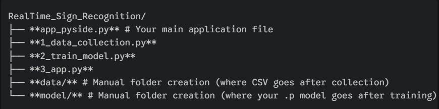

# 🤖 Real-Time Sequential Sign Recognition and Translation

A desktop application built with **PySide6** (Qt) that uses **Machine Learning (Logistic Regression)** and **MediaPipe** to detect sign language gestures in real-time, converts them into a sentence, and provides text-to-speech (TTS) and translation services.

## ✨ Features

* **Real-Time Gesture Detection:** Utilizes the webcam to capture 63 hand landmarks per frame via **MediaPipe Hands**.
* **Sequential Recognition:** Employs a frame-based buffer and stability check to accurately build recognized signs into a continuous, non-jittery sentence.
* **Intuitive UI/UX:** Features a dark, dynamic interface built with **PySide6** that automatically scales and maintains aesthetic proportions when the window is resized.
* **Multilingual Translation:** Translates the recognized English sentence into dozens of international and Indian languages using the **Google Translate API**.
* **Text-to-Speech (TTS):** Converts the final (English or translated) sentence into speech using **gTTS** and plays it back using a thread-safe **Pygame Mixer** implementation, preventing UI freezing and file-locking errors.

---

## 🛠️ Project Structure

The project is organized into three main functional folders—**scripts**, **data**, and **model**—to separate the application logic from the training workflow.

RealTime_Sign_Recognition/ 



---

## 🚀 Getting Started

Follow these four steps sequentially to set up the environment, generate data, train the model, and run the GUI application.

### 1. Setup and Dependencies

1.  **Clone the repository:**
    ```bash
    git clone https://github.com/Sairam06-04/RealTime-Sign-Recognition.git
    cd RealTime-Sign-Recognition
    ```

2.  **Create Folders:** You must manually create the empty directories:
    ```bash
    mkdir data
    mkdir model
    ```

3.  **Setup and Activate Virtual Environment:**
    ```bash
    python -m venv venv-mp-signs
    # Activate the environment (e.g., .\venv-mp-signs\Scripts\activate)
    ```


4.  **Install Required Libraries:**
    ```bash
    pip install -r requirements.txt
    ```

### 2. Data Collection (1_data_collection.py)

Run this script to gather landmark data for all the signs you want the model to recognize.

```bash
python 1_data_collection.py
```
# Follow the prompts to enter labels and press 'C' to capture samples for each sign.


### 3. Model Training (2_train_model.py)
Once sufficient data is collected (at least two distinct signs), run the training script. This automatically creates and saves the necessary model file.

```bash
python 2_train_model.py
```

### 4. Running the Application (app_pyside.py)
With the model/sign_language_model.p file created, launch the complete GUI application.

```bash
python app_pyside.py
```
The application will launch. Click START CAMERA, perform your trained signs, and test the full Translation and Text to Voice functionality.

### 🤝Contribution
**Contributions, bug reports, and feature suggestions are highly welcome! Please feel free to open an issue or submit a pull request.*
